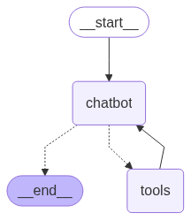

# Local-AI-Agent-Starter-Kit

A local LangChain-based agent starter kit with a graph workflow for tool execution using Ollama. This project provides a foundation for building AI agents using LangChain and LangGraph, with a focus on tool execution and workflow management.

> **Disclaimer**: This project is primarily for learning purposes and serves as a starter kit for building AI agents. It's an experimental implementation that provides a foundation for exploring and understanding the concepts of AI agent development, tool execution, and workflow management.

## Features

- Graph-based workflow using LangGraph
- Tool execution with proper error handling
- Modular node-based architecture
- Easy to extend with new tools and nodes
- VectorStore for managing and querying document embeddings

## Graph


## Requirement
You need Ollama running (https://ollama.com/).
If you want to change the model, update the `OLLAMA_MODEL` string in the `src/config/setting.py` file.

## Installation

```bash
# Clone the repository
git clone https://github.com/delkaspo/ai-agent.git
cd ai-agent

# Install dependencies
poetry install
```

## Usage

Run the agent with a query:
```bash
poetry run agent query -q "hello"
```

Run the agent interactive mode:
```bash
poetry run agent run
```

Create a PNG of the graph:
```bash
poetry run agent visualize
```

Add documents to the vector store:
```bash
poetry run agent add-docs -p /path/to/documents
```

## Project Structure

```
ai-agent/
├── src/
│   ├── cli.py              # Command line interface
│   ├── config/             # Configuration settings
│   ├── graph/              # Workflow graph implementation
│   │   ├── nodes/          # Graph nodes
│   │   ├── types.py        # Type definitions
│   │   └── workflow.py     # Workflow definition
│   └── tools/              # Tool implementations
│       ├── datetime_tool.py # Date and time related tools
│       ├── web_search.py   # Web search functionality
│       └── vectorstore.py  # Vector store management
├── tests/                  # Test suite
├── pyproject.toml         # Project configuration
└── README.md              # This file
```

### Running Tests

The project uses pytest for testing. To run the tests:

```bash
# Run all tests
poetry run pytest

# Run specific test file
poetry run pytest tests/tools/test_datetime_tool.py
```
